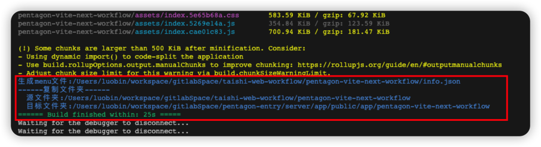
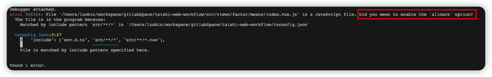

# pentagon子应用创建指南
- [pentagon子应用创建指南](#pentagon子应用创建指南)
  - [工程创建](#工程创建)
  - [工程配置](#工程配置)
    - [构建模式](#构建模式)
    - [三个vite插件](#三个vite插件)
      - [geneMenu：生成info.json文件](#genemenu生成infojson文件)
      - [timer：统计构建耗时](#timer统计构建耗时)
      - [copyDist：本地联调时复制文件夹](#copydist本地联调时复制文件夹)
    - [一个vue插件](#一个vue插件)
      - [registerPentagon:子应用注册](#registerpentagon子应用注册)
  - [Eslint\&Tsc规范](#eslinttsc规范)
    - [规范细节](#规范细节)
    - [规范落地](#规范落地)
    - [常见错误](#常见错误)
      - [Did you mean to enable the 'allowJs' option?](#did-you-mean-to-enable-the-allowjs-option)
      - [提交前没有执行eslint\&tsc检查](#提交前没有执行eslinttsc检查)


## 工程创建
工程使用vue3官方脚手架生成，目录结构也是按照官方标准，减少沟通成本，新手可以很好上手

```
npm init vue@latest
```

## 工程配置
### 构建模式
+ 独立构建:npm run build
  + 一般方式的构建，可以放在本地http容器中启动
+ 集成构建:npm run pentagon(或npm run build-app)
  + 构建后放在pentagon容器中，可以集成到整体页面
  
qiankun的两种构建使用同一套指令，但我们使用了两套指令，根本原因是：资源路径不一致，集成模式需要生成info.json文件

> 引入独立构建好处？


### 三个vite插件
#### geneMenu：生成info.json文件
+ outDir：构建产物文件夹，默认:./dist
#### timer：统计构建耗时
+ 无参数
#### copyDist：本地联调时复制文件夹
> 本插件仅在本地联调时使用，不用时可以注释掉

+ srcPath：源文件夹地址
+ destPath：目标文件夹地址

在本项目中，只需要在根目录下创建`.env.pentagon`文件，添加如下配置
```
VITE_PENTAGON_ENTRY_PATH=../pentagon-entry/
```
其中值为pentagon-entry相对本项目的路径

  

### 一个vue插件
#### registerPentagon:子应用注册
封装了pentagon子应用注册到主应用的逻辑
> 主要涵盖了taishi-web项目中：src/entry,src/service,script三个文件夹的相关逻辑

```
 
import { registerApp } from 'pentagon'
import { registerPentagon } from 'rb-vue-plugins'
import routes from './router/config'
...
app.use(registerPentagon, { routes, registerApp })
```
 
## Eslint&Tsc规范

### 规范细节
eslint规范不做赘述，可以参见张子昂的相关文档:[eslint前端规范](https://w.src.corp.qihoo.net/taishi/taishi-web/-/issues/21)

tsc规范主要一点:`"allowJs": false`

### 规范落地
> 规范落地不是靠人的自觉行为，而是靠机制的有效反馈

+ step1:vscode的配置，保存自动格式化
  + 无意义的操作交给工具完成
  + 修改settings配置，所有开发同步
+ step2:git hooks的强制执行
  + commit前会执行eslint，不可跳过
+ step3:其他开发者的反馈
  + 如果违规，其他开发者可以知道
  
所有前端开发在用户空间或者工作空间的配置中添加如下:
```
{
  // 保存自动格式化（如果和其他配置冲突，本行配置可删掉）
  "editor.formatOnSave": true,
  // 缩进统一设置为2
  "editor.codeActionsOnSave": {
    "source.fixAll.eslint": true
  }
}
```

### 常见错误
#### Did you mean to enable the 'allowJs' option?
解决方案：在vue文件的script标签中添加`lang="ts"`

  

#### 提交前没有执行eslint&tsc检查
解决方案：重新执行下`npm i`
 